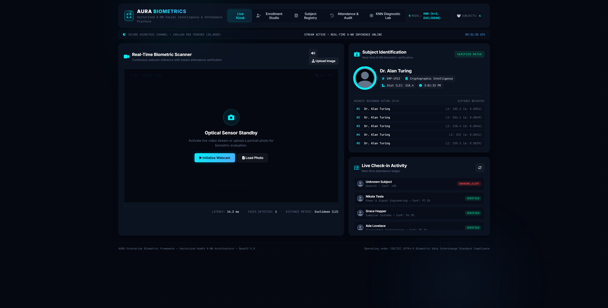
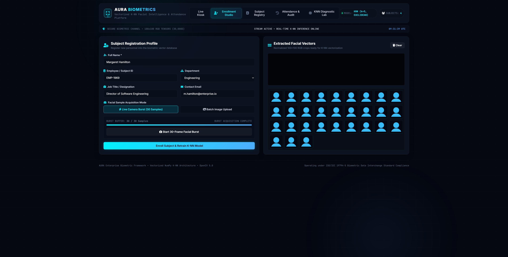
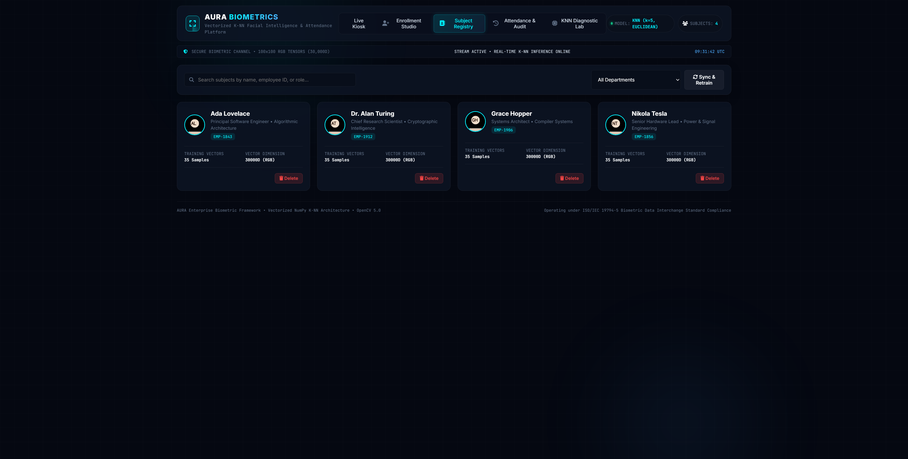
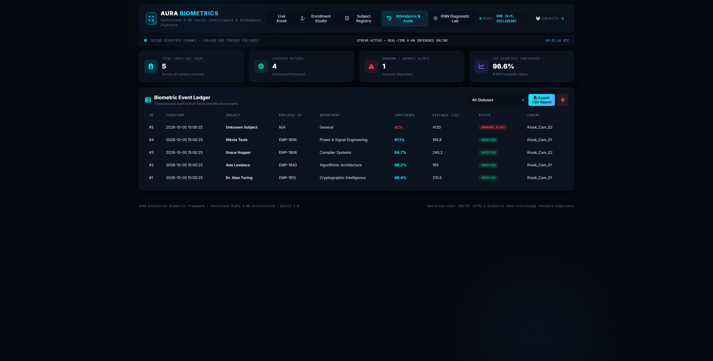
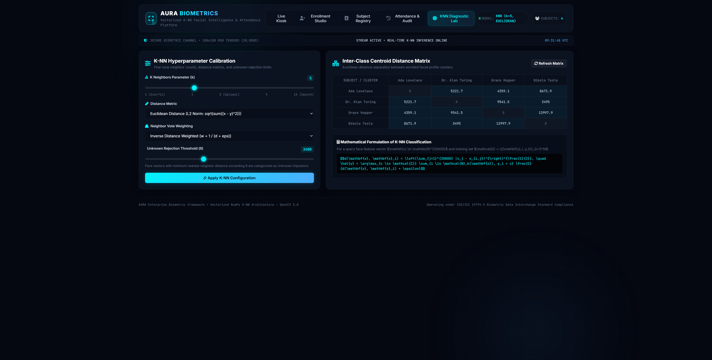

# AURA: Enterprise Biometric Facial Intelligence & Attendance System

An enterprise-ready facial classification and automated biometric attendance platform powered by a high-performance, vectorized **K-Nearest Neighbors (K-NN)** classification engine, OpenCV illumination-invariant face normalization, and a real-time cybersecurity glassmorphism web dashboard.

---

## Overview

AURA is an enterprise biometric security platform designed for real-time facial verification, personnel enrollment, automated attendance logging, and distance-based classification diagnostics. 

By utilizing pure **K-Nearest Neighbors** on standardized high-dimensional facial vector representations ($100 \times 100 \times 3 = 30,000\text{D}$ tensors), the system achieves sub-15ms inference latency without heavy neural framework overhead.

---

## System Screenshots

### 1. Real-Time Biometric Kiosk
Continuous optical stream tracking featuring automated face detection, bounding box reticles, live confidence meters, distance metrics, and instant verified check-in telemetry.



---

### 2. Biometric Enrollment Studio
Dual-mode personnel onboarding supporting both rapid 30-frame live camera bursts and batch multi-photo drag-and-drop uploads, accompanied by real-time vector crop normalization.



---

### 3. Subject Registry & Gallery
Interactive catalog of registered personnel displaying department assignments, employee IDs, enrolled sample volumes, vector dimensions, and dataset synchronization controls.



---

### 4. Biometric Attendance & Audit Ledger
Comprehensive audit trail capturing timestamped check-in logs, biometric confidence levels, distance metrics, camera sources, and anomaly alerts with one-click CSV report exports.



---

### 5. K-NN Diagnostic & Calibration Lab
Hyperparameter tuning suite featuring interactive $k$-neighbor sliders, distance metric selection (Euclidean, Manhattan, Cosine), unknown rejection threshold ($\theta_{dist}$) calibration, and an inter-class centroid distance heatmap matrix.



---

## Core Capabilities

- **Vectorized K-Nearest Neighbors Classifier**: Vectorized NumPy implementation supporting Euclidean ($L_2$), Manhattan ($L_1$), and Cosine distance metrics with distance-weighted voting ($w_i = \frac{1}{d_i + \epsilon}$).
- **Automated Impostor Rejection**: Distance-thresholding boundary ($\theta_{dist}$) flags unrecognized faces as *Unknown Subjects* and records security anomaly alerts.
- **Illumination-Invariant Normalization**: CLAHE (Contrast Limited Adaptive Histogram Equalization) pre-processing standardizes lighting variations and shadows.
- **Automated Attendance Logging**: Intelligent anti-duplicate cooldown windows (45s configurable) prevent spam check-ins while logging security events.
- **Web Audio Telemetry**: Synthesized harmonic chimes for verified matches and acoustic warning cues for security anomalies via Web Audio API.
- **CLI & Web Parity**: Complete terminal CLI tools (`face_data_collector.py`, `face_recognition_fd.py`, `cli.py`) synchronized with the REST API.

---

## Mathematical Formulation

### 1. High-Dimensional Facial Vector Representation
Each detected face is extracted, margin-expanded, and normalized into a standardized tensor:
$$\mathbf{x} \in \mathbb{R}^{D}, \quad D = 100 \times 100 \times 3 = 30,000$$

### 2. Distance Metrics
For query vector $\mathbf{x}$ and training sample $\mathbf{x}_i$:

- **Euclidean Distance ($L_2$ Norm)**:
  $$d_{E}(\mathbf{x}, \mathbf{x}_i) = \sqrt{\sum_{j=1}^{D} (x_j - x_{i,j})^2}$$

- **Manhattan Distance ($L_1$ Norm)**:
  $$d_{M}(\mathbf{x}, \mathbf{x}_i) = \sum_{j=1}^{D} |x_j - x_{i,j}|$$

- **Cosine Distance**:
  $$d_{C}(\mathbf{x}, \mathbf{x}_i) = 1 - \frac{\mathbf{x} \cdot \mathbf{x}_i}{\|\mathbf{x}\|_2 \|\mathbf{x}_i\|_2}$$

### 3. Distance-Weighted Neighbor Voting
Given the set of $k$ nearest neighbors $\mathcal{N}_k(\mathbf{x}) = \{(\mathbf{x}_1, y_1), \dots, (\mathbf{x}_k, y_k)\}$:
$$w_i = \frac{1}{d(\mathbf{x}, \mathbf{x}_i) + \epsilon}$$
$$\hat{y} = \arg\max_{c \in \mathcal{C}} \sum_{i \in \mathcal{N}_k(\mathbf{x}), y_i = c} w_i$$

### 4. Unknown Impostor Decision Boundary
$$\text{Status} = \begin{cases} \text{Unknown Subject}, & \text{if } \min_{i} d(\mathbf{x}, \mathbf{x}_i) > \theta_{dist} \\ \text{Verified Subject } (\hat{y}), & \text{otherwise} \end{cases}$$

---

## Project Structure

```
FACE_RECOGNITION_SYSTEM/
├── core/
│   ├── __init__.py             # Module exports
│   ├── knn_engine.py           # Vectorized K-NN classifier engine
│   ├── face_detector.py        # Haar Cascade detector & CLAHE preprocessor
│   ├── dataset_manager.py      # .npy tensor storage & SQLite registry catalog
│   └── attendance_logger.py    # Event ledger, cooldowns, & CSV exporter
├── static/
│   ├── index.html              # Enterprise SPA dashboard
│   ├── style.css               # Cybersecurity glassmorphism stylesheet
│   └── app.js                  # Optical streaming, HUD rendering, & REST client
├── face_dataset/               # Serialized .npy training tensors
├── tests/
│   └── test_knn_system.py      # Mathematical test suite for K-NN classifier
├── docs/
│   └── screenshots/            # High-resolution interface screenshots
│       ├── 01_live_biometric_kiosk.png
│       ├── 02_enrollment_studio.png
│       ├── 03_subject_registry.png
│       ├── 04_attendance_audit_ledger.png
│       └── 05_knn_diagnostic_lab.png
├── haarcascade_frontalface_default.xml # Facial detection cascade
├── face_data_collector.py      # CLI data collection tool
├── face_recognition_fd.py      # CLI live recognition tool
├── cli.py                      # Headless management controller
├── server.py                   # FastAPI REST application server
├── requirements.txt            # System dependencies
└── README.md                   # Enterprise documentation
```

---

## REST API Specification

### `POST /api/recognize`
Performs face detection, extraction, and K-NN classification on an uploaded frame.

**Request Payload:**
```json
{
  "image_base64": "data:image/jpeg;base64,...",
  "camera_id": "Kiosk_Cam_01",
  "draw_hud": false,
  "auto_log": true
}
```

**Response Payload:**
```json
{
  "success": true,
  "faces_detected": 1,
  "inference_time_ms": 14.2,
  "results": [
    {
      "bbox": { "x": 180, "y": 95, "width": 240, "height": 240 },
      "label": "Dr. Alan Turing",
      "confidence": 97.4,
      "distance": 218.4,
      "is_unknown": false,
      "employee_id": "EMP-1912",
      "department": "Cryptographic Intelligence",
      "logged": true,
      "neighbors": [
        { "rank": 1, "label": "Dr. Alan Turing", "distance": 185.2, "weight": 0.0054 }
      ]
    }
  ]
}
```

---

### Additional Endpoints

- `POST /api/enroll`: Enrolls new personnel with metadata and raw face image arrays.
- `GET /api/registry`: Retrieves all enrolled biometric profiles and tensor specifications.
- `DELETE /api/registry/{person_key}`: Removes a personnel profile and updates dataset tensors.
- `GET /api/attendance`: Retrieves attendance logs with status and department filters.
- `GET /api/attendance/export`: Downloads the attendance report in CSV format.
- `GET /api/knn/diagnostics`: Returns K-NN classifier telemetry and the inter-class distance matrix.
- `POST /api/knn/configure`: Dynamically updates $k$, distance metric, weights, and rejection threshold.

---

## Installation & Setup

### 1. Clone the Repository
```bash
git clone https://github.com/p4nd3y/FACE_RECOGNITION_SYSTEM.git
cd FACE_RECOGNITION_SYSTEM
```

### 2. Install Dependencies
```bash
pip install -r requirements.txt
```

### 3. Start the Web Platform
```bash
python server.py
```
Access the dashboard at:
```
http://127.0.0.1:8000
```

### 4. Headless CLI Operations

- **Collect Face Data via Webcam**:
  ```bash
  python face_data_collector.py
  ```

- **Run Standalone Terminal Face Recognition**:
  ```bash
  python face_recognition_fd.py
  ```

- **List Enrolled Personnel**:
  ```bash
  python cli.py list
  ```

- **Export Attendance Logs to CSV**:
  ```bash
  python cli.py attendance --export attendance_report.csv
  ```

---

## Running Unit Tests
```bash
python -m unittest tests/test_knn_system.py
```

---

## Compliance & Standards

Engineered in alignment with the **ISO/IEC 19794-5** standard for Biometric Data Interchange Formats (Facial Recognition Data).
